## AWS SageMaker 를 사용한 심장병 예측 

머신 러닝은 잠재적으로 의사와 과학자들이 심장병을 예측하는 데 중요한 역할을 할 수 있습니다. 심장병에 걸릴 확률은 당뇨병, 고혈압, 높은 콜레스테롤, 비정상적인 심장 박동 수, 그리고 나이와 같은 많은 요소들을 포함합니다. 이 샘플에서는 AWS SageMaker를 사용하여 심장 질환의 존재를 잠재적으로 예측할 수 있는 linear learner 알고리즘을 학습합니다.

참고: 이는 샘플 애플리케이션일 뿐이며 이를 의료적인 조언으로 간주하시면 안됩니다.

## 아키텍처

이 워크숍의 아키텍처는 다음과 같습니다:

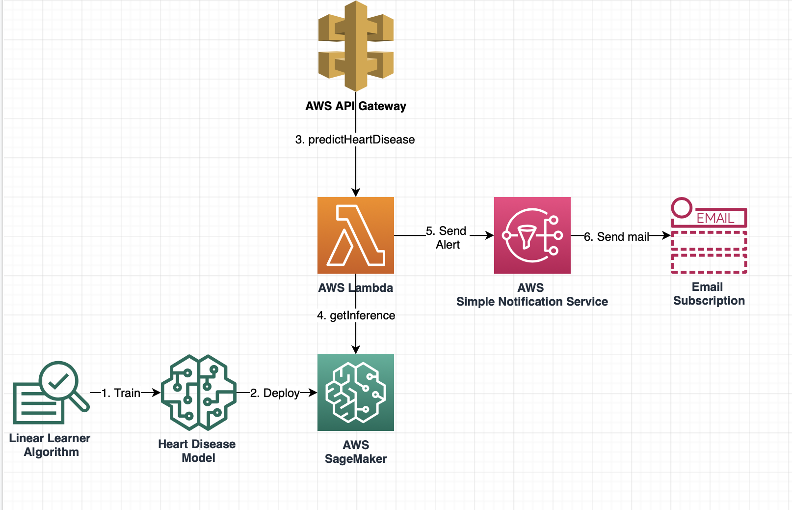

## 설명

이 프로젝트는 [UCI 저장소](https://archive.ics.uci.edu/ml/datasets/Heart+Disease)에서 가져온 [Cleveland Heart Disease 데이터 세트](https://archive.ics.uci.edu/ml/machine-learning-databases/heart-disease/cleveland.data)를 사용합니다. 데이터 세트는 개인의 특징(나이, 심박수, 성별, 혈압 등)을 측정하는 303개의 기록으로 구성됩니다. 위에서 설명한 것처럼 먼저 SageMaker의 linear learner 알고리즘을 사용하여 모델을 훈련하고 배포합니다. 모델이 배포되면 AWS API Gateway를 사용하여 데이터 세트에 대한 실시간 예측을 얻을 수 있습니다. 모델이 심장 질환의 존재를 예측하면 SNS 알림이 사용자 이메일 주소로 전송됩니다.

## Quick Start

Quick start는 cloud formation을 사용하여 AWS 계정에 샘플 애플리케이션을 배포합니다.

Quick Start 설정

사전 설정:
1.	AWS에 로그인하거나 [계정을 생성](https://us-west-2.console.aws.amazon.com)
2.	[S3 버킷을 생성합니다](https://docs.aws.amazon.com/AmazonS3/latest/gsg/CreatingABucket.html)
   - 중요: 버킷 이름이 'sagemaker'로 시작하는지 확인하십시오. 이렇게 해야 SageMaker가 버킷에 액세스할 수 있습니다
   - 리전을 기록해 두십시오. 사용된 모든 서비스가 S3 버킷과 동일한 지역에 있는지 확인합니다.
3.	**/src/main/resources** 디렉터리에 있는 **'heart.csv'** 파일을 위에서 생성한 S3 버킷에 업로드합니다.
4.	생성한 S3 버킷의 루트 디렉토리에 제공된 패키지 코드 **‘heart_function-1.0.0’** 를 업로드합니다.
5. **heart-disease-prediction.ipynb** 파일을 로컬 컴퓨터에 다운로드 합니다.

### SageMaker 모델 학습
이 섹션에서는 AWS SageMaker를 사용하여 샘플 jupyter 노트북을 가져오고 심장 질환을 예측할 수 있는 모델을 학습합니다. 모델이 학습되면 SageMaker에서 직접 호스팅됩니다.

1.	AWS 콘솔의 서비스 목록에서 **Amazon SageMaker** 를 선택합니다.
2.	SageMaker 콘솔의 왼쪽 네비게이션 패널에서 **Notebook instances** 를 선택합니다

 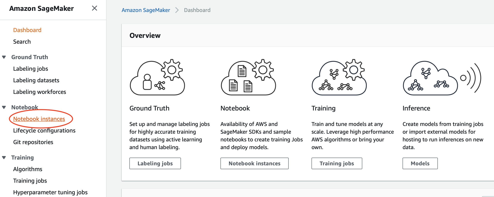

3.	**노트북 인스턴스 생성**을 클릭합니다.
4.	노트북의 **이름**을 기입하고 나머지 필드는 기본값으로 둡니다.

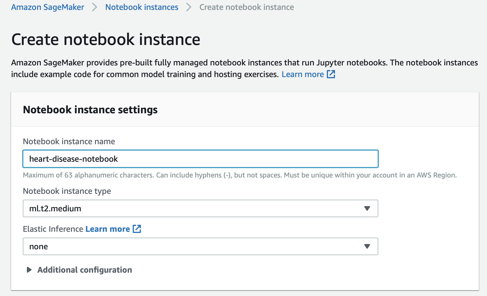

5.	노트북 인스턴스 생성을 클릭합니다.
6.	노트북 인스턴스가 ‘**In Service’** 상태가 되면 **Jupyter 열기**를 클릭합니다.
7.	**Upload**를 클릭합니다.
8.	**heart-disease-prediction.ipynb** 파일을 선택합니다.
9.	**Upload** 를 다시 눌러 업로드를 완료합니다.

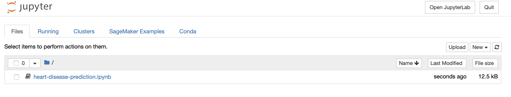

10.	**heart-disease-prediction.ipynb** 클릭하여 엽니다.
11.	코드가 포함된 첫 번째 섹션까지 스크롤하고 이전에 만든 **S3 버킷 이름**을 입력합니다.

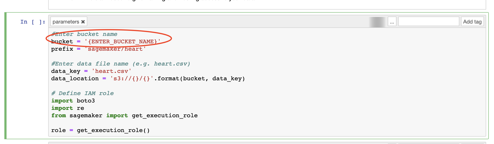

12.	버킷 이름을 바꿔주셨으면 **Run** 을 클릭합니다.

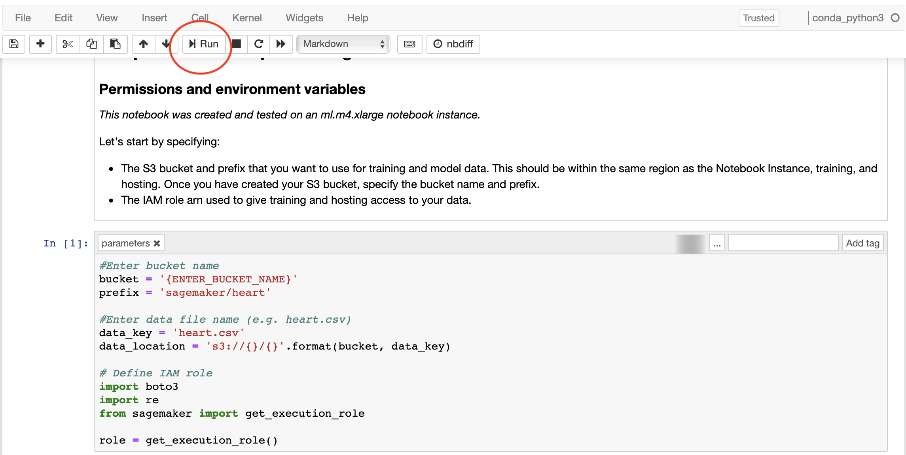

13.	셀 블록의 실행이 완료되면 셀 옆에 번호가 표시됩니다. **Continue clicking on Run**을 계속 클릭합니다.
참고: 모델을 학습하고 배포하는 부분에서 가장 오랜 시간이 걸립니다.

14.  모델을 호스팅한 후 **endpoint 이름**을 복사합니다. cloud formation 템플릿을 배포할때 이 endpoint 이름을 사용합니다.

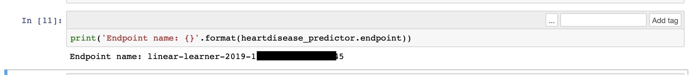

15.	나머지 셀을 계속 실행하여 SageMaker 모델에 대한 예측을 얻을 수 있습니다.
      경고: '(옵션) 엔드포인트 삭제' 셀을 실행하지 마십시오.

### Cloud Formation 템플릿 배포

이 섹션에서는 다음 작업을 수행하는 Cloud Formation 템플릿 배포합니다.:
- API Gateway 생성
- SageMaker endpoint를 호출하는 Lambda 함수
- 이메일을 보내는 SNS 알람 생성

1.	AWS Console의 서비스 목록에서 **CloudFormation** 를 클릭합니다.
2.	**Create Stack** 을 클릭합니다.
3.	**Template is ready** 을 선택 후 **Upload a template file** 을 선택합니다.
4.	프로젝트 루트 디렉토리에 있는 **cloud_formation_template.yaml** 파일을 선택합니다.
5.	다음 페이지에서 Stack 설정을 진행합니다.
   - **stack name** 설정
   - 앞서서 생성한 **S3 버킷명** 입력
   - **Email** 주소 입력. 이 메일 주소는 심장 질환이 예측될 경우 알림을 보내는 데 사용됩니다.
   - 업로드한 **lambda code** 입력 (앞서 S3 버킷에 업로드한 코드 입니다)
   - **SageMaker endpoint** 를 입력 (앞서 복사한 endpoint)

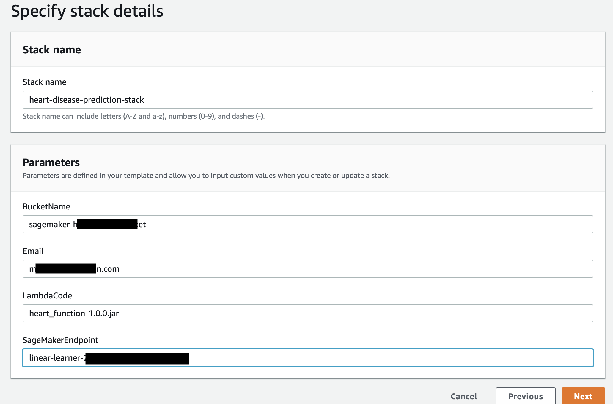

6.	**Next** 클릭
7.	이후 페이지에서 다른 모든 필드를 **default** 값으로 유지하고 **Next**를 클릭합니다
8.	마지막 페이지에서 **acknowledge all Transform might require access capabilities** 항목을 체크합니다. 마지막 
9.	**Create Stack** 클릭
10. Stack 이 성공적으로 생성되었으면, **Output** 탭으로 이동합니다.
11. **prodDataEndpoint** 값을 복사합니다. 이는 실시간 예측에 사용되는 API Gateway 엔드포인트 입니다.

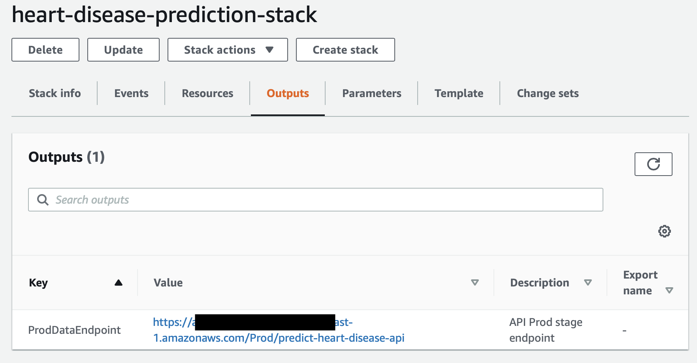

### 심장 질환 실시간 예측

Cloud formation 템플릿은 심장병을 예측하기 위해 실시간으로 호출할 수 있는 엔드포인트를 만들었습니다. 우리는 심장 질환에 대한 예측을 하기 위해 아래의 샘플 데이터를 사용할 것입니다.

샘플 데이터:
API Gateway 콘솔 또는 Postman을 사용하여 API를 실시간으로 호출할 수 있습니다. 아래는 심장 질환 예측을 할 샘플 데이터입니다.

{"age": "23","sex": 1,"cp": 3,"trestbps": 145,"chol": 233,"fbs": 1,"restecg": 0,"thalach":150,"exang": 0,"oldpeak": 2.3,"slope": 0,"ca": 0,"thal": 1}

위의 호출은 실시간 예측을 반환합니다:

 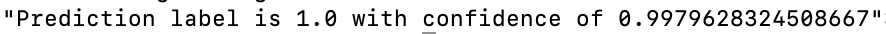
 
 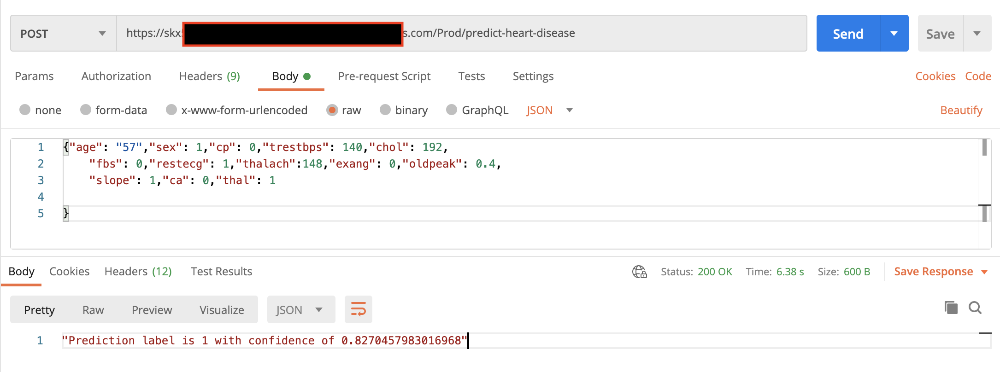

참고: 예측 레이블이 1이면 알림 이메일도 전송됩니다. 먼저 이메일 구독을 확인해야 할 수도 있습니다.

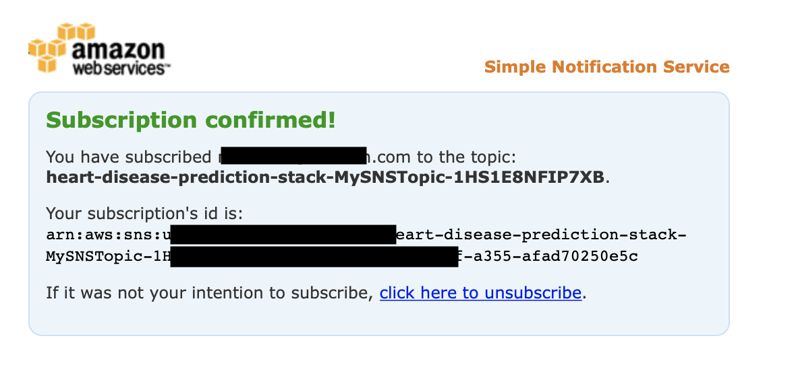

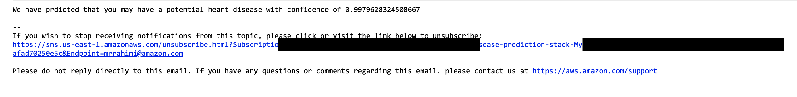

## License

This library is licensed under the MIT-0 License. See the LICENSE file.

